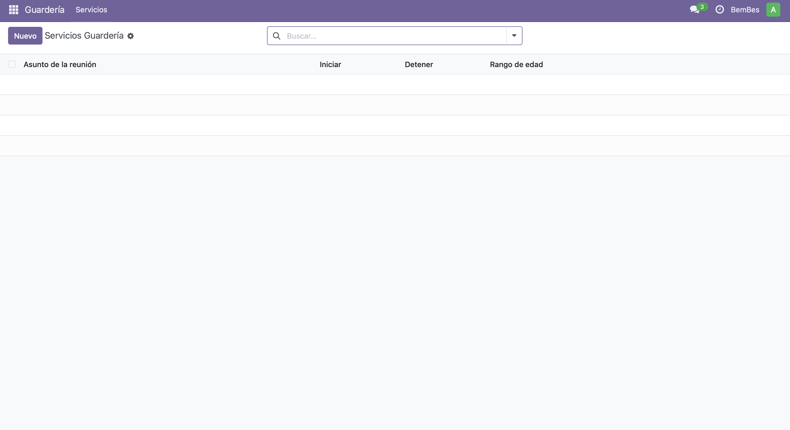
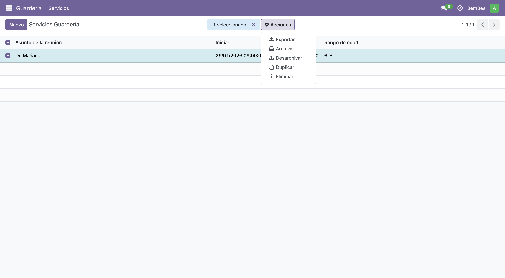
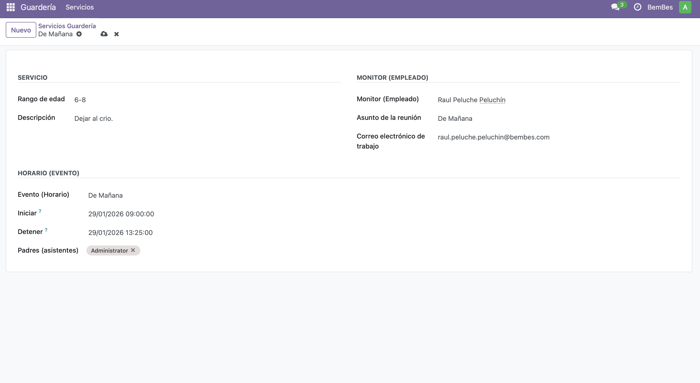

# 🧸 Módulo Guardería – Odoo 18

## 📌 Descripción
Este módulo implementa un **Servicio de Guardería** en Odoo 18 utilizando **multiherencia por delegación** (`_inherits`).

El objetivo es crear un modelo propio que **delegue campos y comportamiento** de:
- `hr.employee` → Monitor / empleado responsable
- `calendar.event` → Horario del servicio

Además, el servicio añade información específica como **descripción** y **rango de edad**, cumpliendo los requisitos de la práctica.

---

## 🧠 Concepto clave: Delegación (`_inherits`)

La delegación permite que un modelo **utilice directamente los campos de otros modelos**, sin necesidad de relaciones clásicas ni prefijos.

Gracias a `_inherits`, el modelo `guarderia.servicio` puede usar campos como:
- `name`, `work_email` (de `hr.employee`)
- `start`, `stop`, `partner_ids` (de `calendar.event`)

como si fueran propios.

---

## 🏗️ Estructura del módulo

```
guarderia/
├── __manifest__.py
├── __init__.py
├── models/
│   ├── __init__.py
│   └── models.py
├── security/
│   └── ir.model.access.csv
├── views/
│   └── views.xml
```

---

## 📦 Dependencias

El módulo depende de los siguientes módulos de Odoo:
- `base`
- `hr`
- `calendar`

Estas dependencias están definidas en el archivo `__manifest__.py`.

---

## 🧩 Modelo principal

**Nombre técnico:** `guarderia.servicio`

### Modelos delegados
- `hr.employee` → mediante el campo `employee_id`
- `calendar.event` → mediante el campo `event_id`

### Campos propios
- `description` → descripción del servicio
- `age_range` → rango de edad (0-2, 3-5, 6-8, 9-11)

---

## 🖥️ Vistas

El módulo incluye:
- Vista **list** (listado de servicios)
- Vista **form** (formulario de creación/edición)
- Acción y menú propios

Menú disponible:
```
Guardería → Servicios
```

Las vistas utilizan directamente campos delegados gracias a `_inherits`.

---

## 🔐 Seguridad

El archivo `ir.model.access.csv` define los permisos necesarios para acceder al modelo `guarderia.servicio`, permitiendo:
- Leer
- Crear
- Modificar
- Eliminar

---

## ⚙️ Instalación

1. Copiar el módulo en la ruta de addons de Odoo:
   ```
   addons/18.0/guarderia
   ```
2. Reiniciar el servidor Odoo
3. Activar el **modo desarrollador**
4. Ir a **Apps → Actualizar lista de aplicaciones**
5. Buscar **Guardería** e instalar el módulo

---

## ✅ Comprobación

Tras la instalación:
- El módulo aparece correctamente en **Apps**
- El menú **Guardería** es visible
- Se pueden crear servicios seleccionando:
  - Un empleado (monitor)
  - Un evento (horario)
- Los campos delegados funcionan sin errores

---

## 🎓 Contexto académico

Este módulo ha sido desarrollado como práctica de la asignatura **SGE**, demostrando:
- Uso correcto de `_inherits`
- Integración entre módulos estándar de Odoo
- Definición de vistas, seguridad y manifiesto

---

## 🌅 Imagenes del modulo funcionando









---
## ✍️ Autor

Alumno: *Javier Alcaraz Martín*  
Curso: DAM  
Asignatura: Sistemas de Gestión Empresarial

---

✔ Módulo probado y funcional en **Odoo 18**

